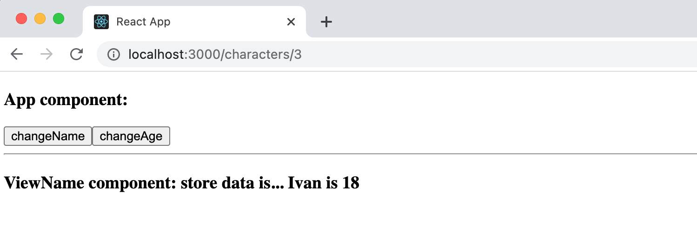
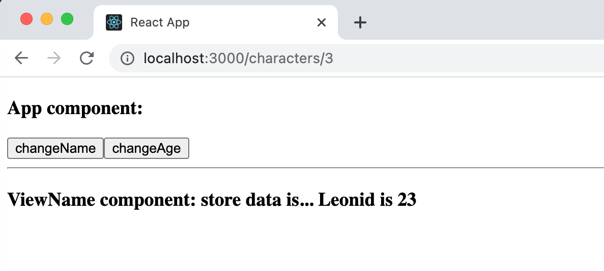

# React Redux simple example

Project was created according to the video lesson ["Курс React / Redux-практика. #16. React Redux. Архитектура. Хуки useDispatch(), useSelector()"](https://www.youtube.com/watch?v=fHx5EQZUz5k&list=PL7cTIfGFrdKkQAWKDu2NdFt5Cx38B-A3i&index=21) by "Dev Pandaren" youtube channel.

### Screenshots:

### Redux working scheme:

